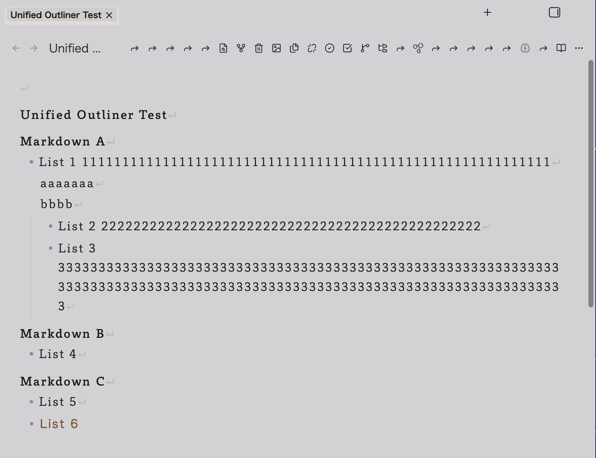
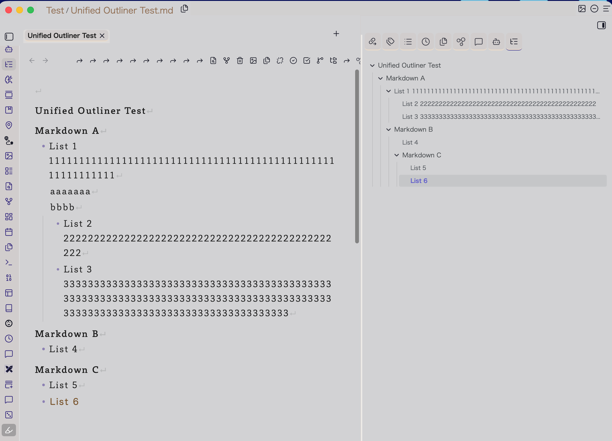
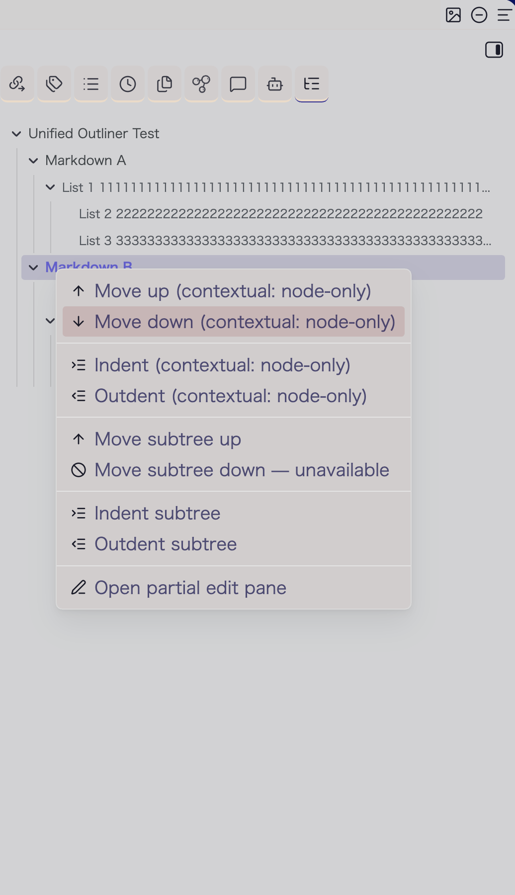
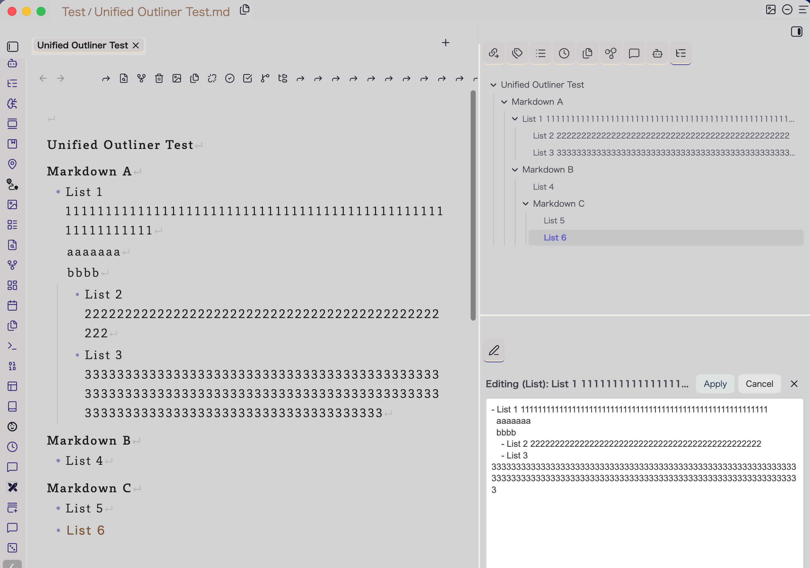
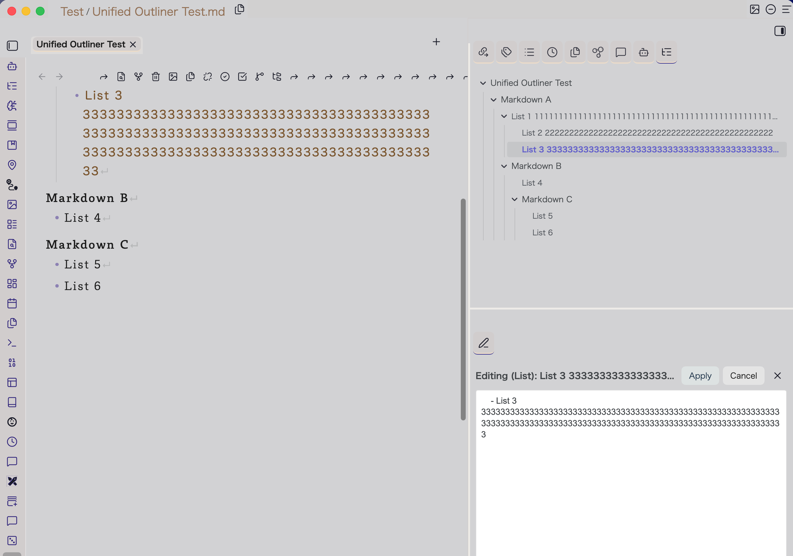

# Unified Outliner

[日本語](README.ja.md)

> Reorganize heading sections and list subtrees in an Obsidian note without losing sight of the surrounding structure.

Unified Outliner is an [Obsidian](https://obsidian.md) plugin for structural editing inside a single Markdown note. It lets you move, re-level, inspect, and focus on heading sections and list subtrees through the editor, a dedicated Outline Tree View, and a focused Partial Edit Pane.

**Current version:** 0.1.0

**Minimum Obsidian version:** 1.8.7

**Scope:** one note at a time. Unified Outliner never moves content between notes.

## Why Unified Outliner?

Obsidian's built-in Outline is excellent for navigating headings. List-focused outliner plugins make it easier to work with individual list items. Unified Outliner is designed for the point where both approaches are needed in the same note: reorganizing meaningful heading sections and nested list structures as visible, safe units.

| Capability | Obsidian built-in Outline | List-focused outliner plugins | Unified Outliner |
| --- | --- | --- | --- |
| Navigate heading structure | Yes | Varies | Yes, with synchronized tree selection |
| Move a whole heading section with its body and child sections | No | Not the primary focus | Yes |
| Move or reparent a nested list subtree | No | Often supported | Yes |
| Display headings and list items together in one structural tree | No | Varies | Yes, optional list display |
| Edit one selected section or list subtree in a focused pane | No | Varies | Yes, with explicit Apply and conflict protection |
| Preserve view folding per file | No | Varies | Yes, synchronized across open Outline Tree Views |

Unified Outliner does not try to replace search, task managers, Dataview-style aggregation, or AI writing tools. Its purpose is dependable structural editing of Markdown notes.

## Install

### Install from a release

Unified Outliner is distributed through [GitHub Releases](https://github.com/kazdonkai/unified-outliner/releases). To install version 0.1.0 manually:

1. Download these three files from the release page: `main.js`, `manifest.json`, and `styles.css`.
2. In your vault, create this folder if it does not already exist:

   ```text
   <your-vault>/.obsidian/plugins/unified-outliner/
   ```

3. Copy all three downloaded files into that folder.
4. Open Obsidian and go to **Settings → Community plugins**. Turn off Restricted mode if necessary, then enable **Unified Outliner**.
5. Reload Obsidian if the plugin does not appear immediately.

A Community Plugins catalog installation will be added after the plugin has completed Obsidian's review process. Until then, use the release-based installation above.

### Update

For a later release, replace the same three files in `<your-vault>/.obsidian/plugins/unified-outliner/`, then reload Obsidian. Keep a backup of your vault as part of your normal update routine.

## Start here



The screenshot uses `Test/Unified Outliner Test.md` in the Method test vault. It shows the kind of heading and nested-list structure that Unified Outliner is designed to reorganize.

1. Open a Markdown note that contains headings or lists.
2. Open the Command Palette and run **Open outline tree view**, or select the plugin's tree icon in the ribbon.
3. The **Outline Tree View** opens in the right sidebar. Clicking a node moves the cursor to the matching location in the note. Moving the editor cursor highlights the corresponding tree node.
4. Right-click a node to move, indent, outdent, or open it in the Partial Edit Pane.

Enable **Show list items in Outline Tree View** in the plugin settings when you want list items to appear alongside headings.

## Visual guide

### Work from the Outline Tree View



The Outline Tree View shows headings and, when enabled, list items beside the source note. Selecting a node locates its matching text, while the current editor position is reflected in the tree.



Right-click a selected node to choose a structural action. The menu exposes block movement, indentation, node-only heading actions, and focused editing from the same place.

### Focus on a selected subtree



The Partial Edit Pane keeps the selected section or list subtree visible while preserving the surrounding outline for orientation.



Apply writes back only after the pane verifies that its original source range has not changed. This protects the note from an accidental overwrite during a concurrent edit.

### Short video walkthroughs

| Task | Video |
| --- | --- |
| Open the Outline Tree View | [Watch the 7-second MP4](docs/media/outline-tree-open.mp4) |
| Collapse and expand a tree node | [Watch the 20-second MP4](docs/media/outline-collapse-expand.mp4) |
| Follow a selected item in the tree | [Watch the 21-second MP4](docs/media/outline-focus.mp4) |
| Move a list subtree | [Watch the 14-second MP4](docs/media/outline-list-move.mp4) |
| Edit a selected subtree in the Partial Edit Pane | [Watch the 49-second MP4](docs/media/partial-edit.mp4) |

## How to use it

### Move and re-level structures

Place the cursor on a heading or list item, then use the Command Palette or assign hotkeys in **Settings → Hotkeys**.

| Command | What it does |
| --- | --- |
| **Move block up** | Moves the current heading section or list subtree before its preceding sibling. |
| **Move block down** | Moves the current heading section or list subtree after its following sibling. |
| **Indent block** | Reparents a list subtree, or safely lowers a heading section's level when the structure allows it. |
| **Outdent block** | Promotes a list subtree, or safely raises a heading section's level when the structure allows it. |

The same actions are available from a node's context menu in Outline Tree View. Unavailable operations make no change. Enable **Show no-op notices** in the plugin settings to see the reason.

### Use the Outline Tree View

The right-sidebar tree is a working view, not only a navigator.

- **Drag and drop sections** to reorder section subtrees.
- **Drag and drop list items** to reorder or reparent list subtrees when list display is enabled.
- **Collapse or expand nodes** to control the tree's own view state. This state is saved per file and stays in sync across open Outline Tree Views.
- **Use contextual commands** from the right-click menu. A collapsed section is treated as a subtree; an expanded section can use node-only actions.

### Edit a focused subtree

Use **Open partial edit pane for current section** from the Command Palette, or choose the corresponding action from an Outline Tree View context menu.

The **Partial Edit Pane** opens the selected section or list subtree in a dedicated editor. Make your changes, then select **Apply** to write them back to the source note. If the source area changed after the pane opened, the pane protects the note by refusing to apply conflicting content. Reload the target and review the change instead of overwriting it.

### Advanced: node-only heading actions

The commands **Move heading label up/down** and **Indent/Outdent heading level** change only the current heading line. They deliberately leave that heading's body and child sections where they are. Use them only when that is exactly the structure you intend; for ordinary reorganization, prefer the block commands.

## Settings

Open **Settings → Community plugins → Unified Outliner** to configure:

- **Allow list moves across sections**: permits root-level list items to move across section boundaries.
- **Normalize ordered list markers to `1.`**: normalizes ordered-list markers after structural edits.
- **Show no-op notices**: explains why an unavailable operation made no change.
- **Show list items in Outline Tree View**: includes list items in the tree.
- **Follow keyboard selection into body editor**: keeps the body editor synchronized while navigating the tree with the keyboard.

The Outline Tree View also supports optional appearance customization through the [Style Settings](https://github.com/community-plugins/obsidian-style-settings) plugin.

## Safe use and current boundaries

Structural changes alter Markdown text. Keep normal vault backups and review an edit if your note uses unfamiliar or highly customized Markdown.

- Unified Outliner works within the active note only. It does not move content between notes.
- Frontmatter and fenced code blocks are excluded from the structural tree.
- Callouts and Mermaid blocks remain an explicit future design area. Their structural editing rules will be defined before the plugin changes them as movable content.
- A focused edit is applied only when the original target has not changed since it was loaded.

## Roadmap

The next development focus is a more capable focused-editing workflow: hoist-like views, pop-out windows, breadcrumb navigation, and carefully expanded subtree editing. Callouts and Mermaid blocks will be addressed through explicit parsing and safety rules before structural mutation is enabled.

See the concise [roadmap](ROADMAP.md) for later directions and deliberate non-goals.

## Contributing

Bug reports and pull requests are welcome. Please include the smallest reproducible Markdown example, the command or tree action you used, the observed result, and the expected result. See [CONTRIBUTING.md](CONTRIBUTING.md) for the development workflow and required checks.

Do not include confidential or personal information in a report.

## License

Unified Outliner is released under the [MIT License](LICENSE). Copyright © 2026 Kazdon Kai.
